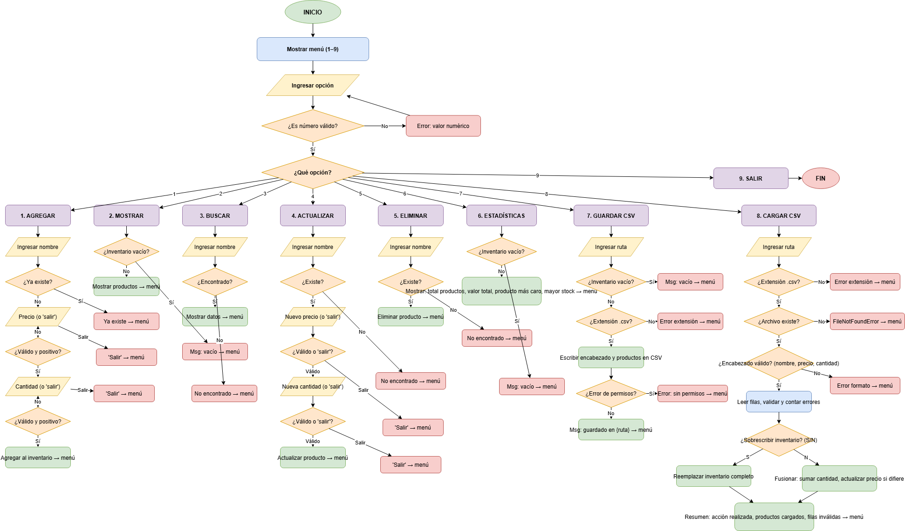

# 📦 Gestión de Inventario

Programa de consola en Python que gestiona el inventario de productos con múltiples funcionalidades: agregar, mostrar, buscar, actualizar, eliminar, estadísticas y manejo de archivos CSV. Incluye validaciones completas de entradas y estructura modular.

---
## 📋 Descripción:
El programa es un sistema completo de gestión de inventario. Ofrece un menú interactivo donde el usuario puede realizar todas las operaciones típicas de un inventario. Los datos se almacenan en memoria durante la ejecución y se pueden guardar o cargar desde archivos CSV. Todas las entradas del usuario están validadas (nombres no vacíos, precios y cantidades mayores a cero, formato correcto de archivos).

---
## ⚙️ Requisitos:
- Python 3.6 o superior
- No requiere librerías externas (solo usa el módulo estándar `csv`)

---
## 🚀 Uso:
Ejecuta el script principal desde la terminal:

```bash
python app.py
```

El programa mostrará un menú interactivo con las siguientes opciones:

| Opción | Descripción |
|--------|-------------|
| 1      | Agregar producto |
| 2      | Mostrar inventario completo |
| 3      | Buscar producto por nombre |
| 4      | Actualizar precio y/o cantidad |
| 5      | Eliminar producto |
| 6      | Calcular estadísticas del inventario |
| 7      | Guardar inventario en CSV |
| 8      | Cargar inventario desde CSV |
| 9      | Salir del programa |

---
## 💡 Ejemplo de ejecución:

```
==============================
| 📦 INVENTORY MANAGEMENT 📦 |
==============================

1. Agregar producto
2. Mostrar inventario
...
Ingrese la opcion (1-9): 1
Ingrese el nombre del producto: Laptop
Ingrese el precio del producto o 'salir' si desea volver al menu: 1250.50
Ingrese la cantidad del producto o 'salir' si desea volver al menu: 8

==============================
| 📦 INVENTORY MANAGEMENT 📦 |
==============================
...
Ingrese la opcion (1-9): 2
1 Producto: Laptop | Precio: $1250.5 | Cantidad: 8
```

---
## 🔒 Validación de datos:
El programa aplica validaciones estrictas en todas las operaciones para evitar errores:

1. **Nombre del producto**: No puede estar vacío.
2. **Precio**: Debe ser un número mayor a 0. Si se ingresa texto o valor ≤ 0, muestra error y vuelve a pedirlo.
3. **Cantidad**: Debe ser un número entero mayor a 0. Si se ingresa texto o valor ≤ 0, muestra error y vuelve a pedirlo.
4. **Archivos CSV**: Verifica que el archivo termine en `.csv`, que tenga el encabezado correcto (`nombre,precio,cantidad`) y que cada fila tenga datos válidos. Las filas inválidas se omiten y se reportan.

Ejemplo de error de validación:
```
Ingrese el precio del producto o 'salir' si desea volver al menu: abc
Error: Ingrese un valor numerico.
```
---

## 📊 Diagrama de Flujo:



---
## 🧠 Lógica del programa:
```
1. Mostrar menú principal
2. Según la opción elegida:
   - 1 → Agregar producto (validar nombre, precio y cantidad)
   - 2 → Mostrar todos los productos
   - 3 → Buscar por nombre
   - 4 → Actualizar precio y cantidad (con opción de cancelar)
   - 5 → Eliminar por nombre
   - 6 → Calcular estadísticas (valor total, producto más caro, mayor stock)
   - 7 → Guardar en CSV
   - 8 → Cargar desde CSV (opción sobreescribir o fusionar)
   - 9 → Salir
3. Todas las operaciones usan funciones modulares (servicios.py y archivos.py)
```

---
## 📁 Estructura del proyecto:
```
Inventory-Management/
├── docs/
│   └── diagrama_de_flujo.png     # Diagrama de flujo del programa
├── .gitignore
├── app.py                        # Archivo principal con el menú
├── archivos.py                   # Funciones para guardar y cargar CSV
├── LICENSE
├── README.md
└── servicios.py                  # Funciones de gestión de productos
```

---
## 👤 Autor:
Edgar Corzo.