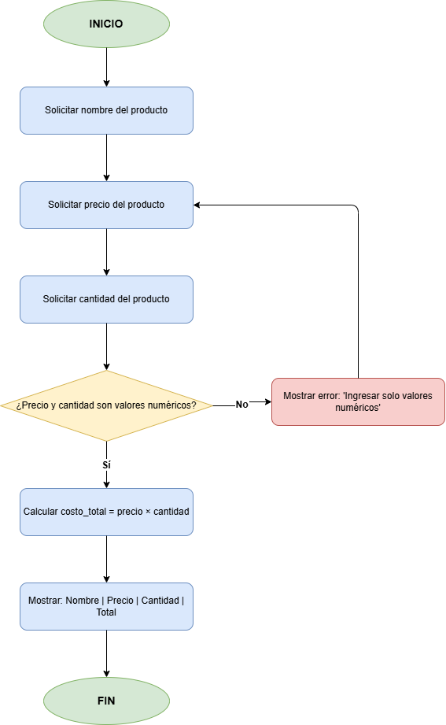

# 📦 Gestión de Inventario
 
Programa de consola en Python que gestiona el inventario de productos, validando las entradas numéricas y calculando el costo total por producto.
 
---
 
## 📋 Descripción
 
El programa guía al usuario a ingresar el nombre, precio y cantidad de un producto. Valida que el precio y la cantidad sean valores numéricos mediante un bucle con manejo de excepciones. Finalmente, calcula el costo total y muestra un resumen formateado.
 
---
 
## ⚙️ Requisitos
 
- Python 3.x
 
No requiere librerías externas.
 
---
 
## 🚀 Uso
 
Ejecuta el script desde la terminal:
 
```bash
python inventario.py
```
 
El programa solicitará los siguientes datos de forma interactiva:
 
| Campo      | Tipo    | Descripción                        |
|------------|---------|------------------------------------|
| Nombre     | Texto   | Nombre del producto                |
| Precio     | Decimal | Precio unitario del producto (USD) |
| Cantidad   | Entero  | Cantidad de unidades               |
 
---
 
## 💡 Ejemplo de ejecución
 
```
Ingrese el nombre del producto: Arroz
Ingrese el precio del producto: $2.500
Ingrese la cantidad del producto: 4
 
Producto: Arroz | Precio: $2.500 | Cantidad: 4 | Total: $10.000
```
 
---
 
## 🔒 Validación de datos
 
Si el usuario ingresa un valor no numérico en el precio o la cantidad, el programa muestra un mensaje de error y vuelve a solicitar los datos:
 
```
Ingrese el precio del producto: $abc
Error: Ingresar solo valores numericos
Ingrese el precio del producto: $
```
 
El bucle se repite hasta que se ingresen valores válidos.
 
---
 
## 📊 Diagrama de Flujo
 

 
---
 
## 🧠 Lógica del programa
 
```
1. Solicitar nombre del producto
2. Repetir hasta obtener valores válidos:
   a. Solicitar precio (float)
   b. Solicitar cantidad (int)
   c. Si hay error → mostrar mensaje y reintentar
3. Calcular: costo_total = precio × cantidad
4. Mostrar resumen formateado
```
 
---
 
## 📁 Estructura del proyecto
 
```
proyecto/
├── inventario.py       # Script principal
└── docs/
    └── diagrama_flujo.png  # Diagrama de flujo del programa
```
 
---
 
## 👤 Autor
 
Edgar Corzo, Dylan Castillo, Jheferson Caceres.